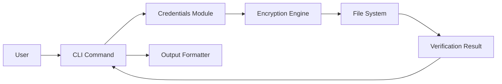

# Browser Automation Framework - Design Overview

## Introduction
This document provides a high-level design overview of the Browser Automation Framework, focusing on the authentication subsystem.

## Architecture

### Core Components
1. **Authentication Module** (`credentials` package)
   - Secure credential storage with AES-256 encryption
   - Key management
   - Credential verification
2. **Command Line Interface** (`commands` subpackage)
   - `check_cred`: Human-readable verification
   - `check_cred_json`: JSON output for scripting
   - `check_cred_bin`: Binary output for integration with other languages
3. **Configuration System** (`config` subpackage)
   - Manages default file paths
   - Ensures secure directory permissions
4. **Message System** (`msg` subpackage)
   - Standardized error codes
   - Localization-ready message handling

### Data Flow

pip install sphinx sphinx-rtd-theme
sphinx-quickstart docs/

extensions = ['sphinx.ext.autodoc', 'sphinx.ext.napoleon']
html_theme = 'sphinx_rtd_theme'